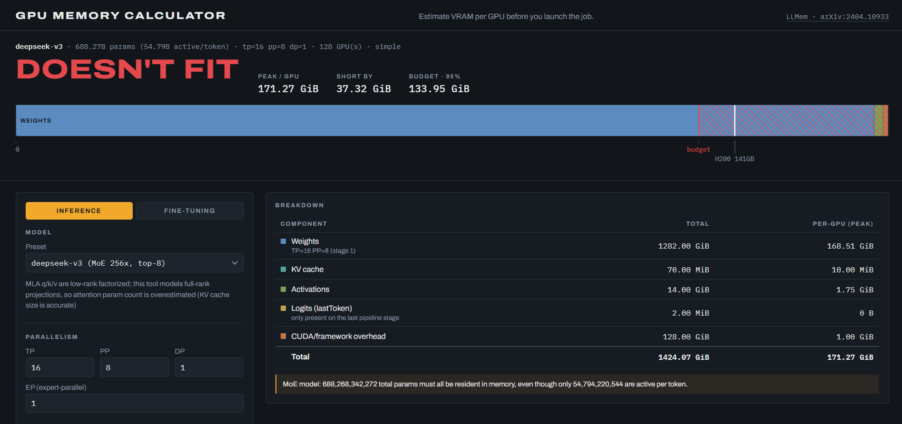

# LLMem GPU VRAM Calculator

A TypeScript library, CLI, and web UI for estimating GPU VRAM usage for LLM **inference** (with KV cache), **fine-tuning** (full / LoRA / QLoRA), and **MoE** models. We also include tensor-parallel (TP), pipeline-parallel (PP), data-parallel (DP), and expert-parallel (EP) specifications.

Fine-tuning memory math is based on [LLMem: Estimating GPU Memory Usage for Fine-Tuning Pre-Trained LLMs](https://arxiv.org/abs/2404.10933) (Kim et al., 2024), included in this repo at [`paper-notes/llmem/2404.10933v1.pdf`](paper-notes/llmem/2404.10933v1.pdf). LLMem covers fine-tuning only; MoE and inference/KV-cache math are this tool's own analytic extensions, built on the same operator-list/parallelism architecture for consistency.

<p align="center">
  
  <br />
  <em><strong>Img.</strong> The web UI detailing not enough VRAM for model inference.</em>
</p>

## Methodology & formulas

Every scenario is built on one shared **operator tensor list** (`src/models/params.ts`): a per-tensor breakdown of the model (embedding, each layer's `q/k/v/o_proj` and FFN, norms, MoE experts/router, `lm_head`), each tagged with how it shards under TP/EP. Weight bytes, optimizer state, KV cache, and LoRA adapter sizing all walk this same list rather than re-deriving shapes independently.

The exact formulas for each scenario — LLMem granular vs. simple fine-tuning fidelity, inference/KV-cache, and TP/PP/DP/EP parallelism — are documented in [docs/methodology.md](docs/methodology.md).

## Getting started

Requires Node.js ≥ 20.

```bash
npm install
npm run build       # compile src/ and cli/ to dist/
npm test             # run the vitest suite
```

### CLI

```bash
# list built-in model presets and GPUs
node dist/cli/main.js models
node dist/cli/main.js gpus

# inference: Llama 3.1 70B on 4x H100 with tensor parallelism
node dist/cli/main.js infer --model llama-3.1-70b --gpu h100-80 --tp 4 \
  --dtype fp16 --seq 8192 --batch 16

# MoE inference with expert parallelism
node dist/cli/main.js infer --model mixtral-8x7b --gpu a100-80 --tp 2 --ep 4 --gpus 8

# QLoRA fine-tune on a 24 GB card, quick analytic estimate
node dist/cli/main.js finetune --model llama-3.1-8b --method qlora --gpu rtx4090-24 \
  --seq 2048 --batch 4 --fidelity simple

# full fine-tuning with ZeRO-3 + tensor parallelism (LLMem's "DP+TP"), paper-faithful math
node dist/cli/main.js finetune --model llama-3.1-8b --method full --zero 3 \
  --tp 2 --dp 4 --gpu a100-80 --fidelity granular

# any model not in the catalog: point at its HuggingFace config.json
curl -sO https://huggingface.co/Qwen/Qwen3-14B/resolve/main/config.json
node dist/cli/main.js infer --hf-config ./config.json --gpu h100-80 --seq 8192
```

Run `node dist/cli/main.js --help` for the full flag reference.

Whenever `--gpu` is given, the fit verdict compares the peak against `--util` of that card's capacity — a fraction, defaulting to `0.75`, mirroring vLLM's `gpu_memory_utilization` haircut for the CUDA context, activation workspace, and fragmentation this tool doesn't model. Values outside `(0, 1]` are rejected rather than clamped, so `--util 75` is an error instead of a silent 100%.

#### Models outside the built-in catalog

Two ways, which compose:

- **`--hf-config <path>`** reads a HuggingFace `config.json` and derives the shape from it. Mutually exclusive with `--model`.
- **Per-field overrides** (`--num-layers`, `--hidden-size`, `--moe-experts`, ...) layer on top of `--model`, on top of `--hf-config`, or stand alone as a fully hand-specified model.

The `config.json` parser is deliberately lenient: only `num_hidden_layers`, `hidden_size`, `num_attention_heads`, and `vocab_size` are required. Anything else it can't find is filled with a conventional default (MHA when `num_key_value_heads` is absent, `4 × hidden_size` for a missing `intermediate_size`, a gated SwiGLU MLP when `hidden_act` is absent) and **every assumption is reported as a warning** alongside the estimate. It reads the naming variants across model families (`num_local_experts` / `n_routed_experts` / `num_experts`), descends into `text_config` for multimodal checkpoints (counting only the language tower), and recognizes `kv_lora_rank` as Multi-head Latent Attention.

### Web UI

```bash
npm run web    # esbuild + local static server on http://localhost:8080
```

Pick a preset from the dropdown, or choose **— Paste a config.json —** at the bottom of it to estimate any model by pasting (or uploading) its HuggingFace `config.json`. The parsed shape is echoed back as a parameter count before you commit to reading the numbers, and the same assumption warnings the CLI prints appear under the breakdown. A pasted config lives for the session only; nothing is stored or uploaded anywhere.

The verdict is drawn as a scale map of the card's memory: your allocation from the left, an amber line at the budget (`capacity x utilization`, the limit the fit check actually uses), the physical capacity wall, and hatching over anything past either. The map is not clamped — a config that overruns the card grows the scale rather than pinning to a full bar, so 12 GiB over and 80 GiB over look different. Swatches in the breakdown table key the segments.

**Usable memory (`gpu_memory_utilization`)** is the same haircut as the CLI's `--util`, expressed as a percentage: it defaults to 75% and is clamped to `[1, 100]` — an out-of-range value snaps back into the field rather than erroring, since the box is edited live. The **EP (expert-parallel)** input only appears when the selected model is MoE.

Or build a static bundle without serving it:

```bash
npm run build:web   # writes web/dist/app.js
```

### Library

```ts
import { estimateInference, estimateFinetune, resolveModel, parseHfConfig, findGpu, checkFit, renderText } from './src/index.js';

const { config } = resolveModel({ preset: 'llama-3.1-8b' });
// ...or, for a model outside the catalog:
// const { config, warnings } = parseHfConfig(await readFile('config.json', 'utf8'));
const breakdown = estimateInference({
  model: config,
  parallelism: { tp: 1 },
  seqLen: 8192,
  batchSize: 1,
  weightDtype: 'bf16',
  kvDtype: 'bf16',
});
console.log(renderText(breakdown, findGpu('h100-80')));
```

## Testing

```bash
npm test           # run once
npm run test:watch # watch mode
npm run typecheck  # tsc --noEmit
```

Every pull request and every push to `master` runs `npm run typecheck`, `npm test`, `npm run build`, and `npm run build:web` on Node 20 and 22 via GitHub Actions (`.github/workflows/ci.yml`).

The test suite (`tests/`) checks:

- **Parameter counts** against published totals (Llama 3.1 8B ≈ 8.03B; Mixtral 8x7B ≈ 46.7B total / 12.9B active).
- **LLMem's exact equations:** a tiny hand-computed synthetic model verifies `m_p`, `m_p16`, `m_os`, `m_out`, `m_lm`, `m_back^tp`, and all four multi-GPU peak formulas (CDP/ADP/TP/DP+TP) against numbers worked out by hand (see `tests/finetune.test.ts` for the full derivation), plus the paper's own ordering invariant `CDP ≥ ADP` and `TP < CDP`.
- **KV cache:** a hand-computed golden (Llama 3.1 8B, 8192 context, batch 1, fp16 → exactly 1 GiB).
- **Sharding conservation:** per-GPU sharded params × shard divisor reconstructs the unsharded total; TP beyond `numKeyValueHeads` leaves K/V weights flat (the GQA replication cliff).
- **Solver round-trips:** `maxBatchSize`/`maxSeqLen` land at or just under GPU capacity, and one unit more doesn't fit.
- **Validation:** bad world sizes, indivisible head/expert counts, and unknown presets throw actionable errors.
- **HuggingFace config parsing:** a real Llama 3.1 8B `config.json` round-trips to a byte-identical estimate against the hand-entered preset; Mixtral/DeepSeek key variants, MLA detection, `text_config` nesting, and every leniency default are covered, along with the error messages for malformed and under-specified input.
- **Web UI (`tests/web.test.ts`):** the real `web/app.ts` entrypoint is run against the real `web/index.html` markup in a happy-dom document — control population, the default verdict/breakdown render, recompute-on-input, the inference/fine-tuning tab swap, the paste-a-`config.json` error and success paths, usable-memory field clamping, and the memory map's "wall stays on-scale when the allocation overruns" invariant.

## Known limitations

- **DeepSeek-V3** uses Multi-head Latent Attention (low-rank factorized q/k/v projections); this tool's generic full-rank attention formula overestimates its attention parameter count. Its KV cache size *is* accurate (via `kvCacheDimPerLayerOverride`).
- Several presets (Qwen3, GPT-OSS) are reconstructed from community-reported configs rather than verified originals; flagged with a `caveat` in the catalog and surfaced as a CLI/UI warning.
- A parsed `config.json` describes the architecture, not the checkpoint: models that interleave dense and MoE layers (`moe_layer_freq` / `decoder_sparse_step` ≠ 1) are modeled as MoE for every layer after the dense prefix, which overcounts expert weights. The parser warns when it sees this.
- Frozen LoRA/QLoRA base weights are modeled as replicated per data-parallel rank, not further sharded by ZeRO/FSDP (a common real configuration), but FSDP-sharded frozen backbones aren't modeled.
- Activation memory (both fidelities) assumes flash-attention-style processing with no O(seq²) attention-score matrix resident.

## TODO

- [x] Add tests to GitHub CI
- [ ] Add calculation support for GGUF based models
- [ ] Adjust calculations based on serving stack e.g., vLLM, llama.cpp, Ollama, etc.
- [ ] Add metrics/specs for other GPU types beyond the current built-in catalog.
- [ ] Support accurate calculation for DeepSeek's Multi-head Latent Attention (currently the generic full-rank attention formula overestimates its attention parameter count — see Known limitations).
- [ ] Add more modern presets for available LLMs, with a search bar in the web UI to find them.

## Project layout

```
src/            core library (types, units, model/GPU catalogs, parallelism, inference, finetune, advise, report)
cli/main.ts     `gpumem infer|finetune|models|gpus`
web/            static HTML/TS UI, bundled by esbuild
tests/          vitest suite
docs/           methodology.md — the exact VRAM formulas for every scenario
paper-notes/    the LLMem paper (2404.10933v1.pdf) and reading notes
```
