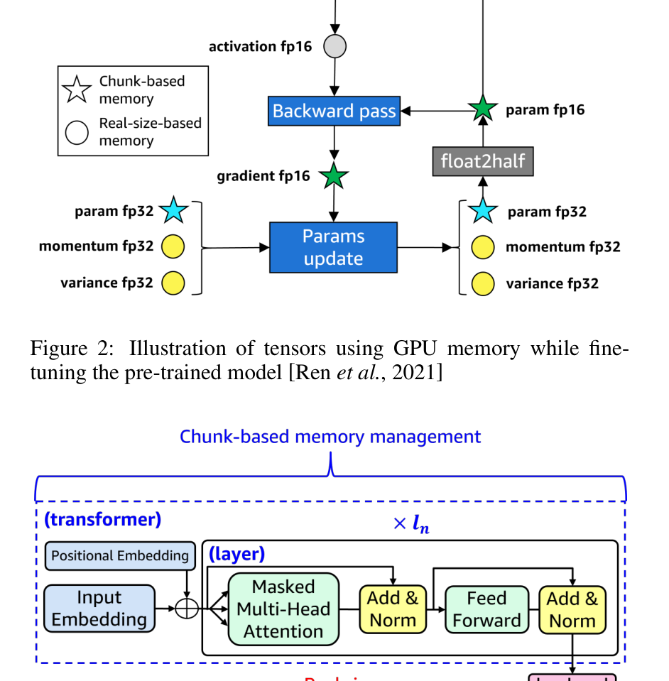
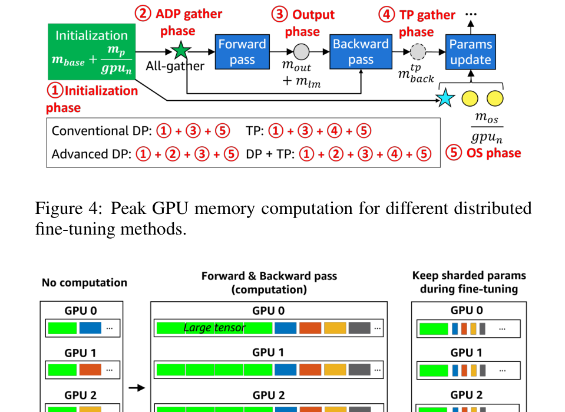

> **Paper**: LLMem: Estimating GPU Memory Usage for Fine-Tuning Pre-Trained LLMs
> **Authors**: Taeho Kim, Yanming Wang, Vatshank Chaturvedi, Lokesh Gupta, Seyeon Kim, Yongin Kwon, Sangtae Ha (University of Colorado Boulder / AWS / ETRI)
> **Published**: arXiv:2404.10933v1 (2024)
> **Reading time**: ~20 minutes
> **Difficulty**: ⭐⭐⭐⭐ (requires familiarity with Transformer internals, mixed-precision training, ZeRO / Megatron-style tensor parallelism)
> **Prerequisites**: Adam optimizer state, ZeRO-3, 1D tensor parallelism (Megatron-LM style), CUDA memory allocation basics

## TL;DR

The scariest part of fine-tuning a pre-trained LLM isn't slow training — it's OOM-ing halfway through. Existing GPU memory estimators (DNNMem) either don't handle mixed precision or ignore how parameters/gradients/optimizer states are actually sharded under distributed training, and routinely miss by 40%+. LLMem models Transformer parameters with chunk-based memory management, handles the lm_head separately by its real tensor size, and applies this accounting to four distributed fine-tuning strategies — Conventional DP, ZeRO-3-style Advanced DP, Tensor Parallelism, and DP+TP — bringing peak-memory estimation error down to 1.6% (single GPU) and 3.0% (multi-GPU), while also recommending which parallelism strategy will finish fastest without OOM-ing, before fine-tuning even starts.

## Paper Overview

**Problem**: Given a pre-trained LLM and a GPU (or GPU cluster), there's no accurate way to know peak memory usage before fine-tuning starts — so users can't tell in advance whether to pick CDP, ZeRO-3, TP, or some combination, and either OOM mid-run or pick a method that fits but is slower than necessary.

**Approach**: Break down exactly which tensors occupy GPU memory at each stage of fine-tuning (initialization → forward → backward → optimizer update) for a Transformer decoder, using two different memory-accounting models for the "Transformer body" versus the "lm_head output layer," then derive peak-memory formulas for each of the four distributed fine-tuning methods.

**Contributions**:
1. A GPU memory estimation method for LLM fine-tuning on both single and multi-GPU setups, with single-GPU error up to 1.6% — far better than DNNMem's 42.6% average error.
2. An algorithm (Algorithm 1) that, given the memory estimates, automatically selects the fastest fine-tuning method among CDP / ADP / TP / DP+TP that avoids OOM.
3. Validation on models with over a billion parameters across 4×Tesla V100 GPUs, achieving 3.0% average error and correctly predicting which models will OOM in a given environment.

## Background and Motivation

The existing GPU memory estimation work DNNMem (Gao et al., 2020) sequentially traverses a DNN's computation graph, estimating memory by analyzing each operator's input/output tensors along with the CUDA context's and allocator's resident buffers. Sections 3.1/3.2 of the paper identify two systematic problems when applying it directly to LLM fine-tuning:

- **No mixed-precision support**: DNNMem doesn't model fp16/fp32 parameters separately, and doesn't account for the fact that in PyTorch mixed-precision fine-tuning, fp16 gradients and fp16 parameters share the same memory.
- **No chunk-based memory management**: chunk managers like the one in Fang et al. (2022) allocate memory for parameters in chunk-sized groups to reduce fragmentation. DNNMem computes memory per-operator based on the actual tensor size, so it can't capture this "pre-allocate by block, waste memory within a block" allocation pattern.

The paper reproduces DNNMem on BERT + GLUE and finds error rates of 19%–42% (Figure 1), growing worse as model size increases — indicating the problem isn't an implementation detail but a fundamental mismatch between DNNMem's memory model and the LLM fine-tuning scenario. More importantly, DNNMem says nothing about multi-GPU scenarios at all: different distributed methods distribute parameters/gradients/optimizer states across GPUs in completely different ways, and naively reusing a single-GPU estimate on multi-GPU leads to exactly the dangerous kind of misjudgment where things "look fine" but actually already OOM.

## Core Method

### 4.1 The Two Phases of the Fine-Tuning Workflow

The paper splits fine-tuning memory into two phases:

- **Initialization phase**: allocates the memory needed for the CUDA context ($m_{base}$), plus the chunk manager pre-allocating chunk-sized memory for param fp16 / param fp32 based on the pre-trained model's parameter count, once it decides the chunk size.
- **Fine-tuning phase**: param fp16 goes through the forward pass, then the backward pass, and is converted into gradient fp16. Because the chunk manager reuses memory blocks, **param fp16 and gradient fp16 share the same GPU memory** (rather than each occupying their own space) — this is one of the key differences between LLMem and DNNMem. After the backward pass, ADAM updates the parameters using param fp32, momentum fp32, and variance fp32 — these three fp32 tensors are *not* allocated during initialization; they're allocated on the **first iteration**, sized to their **actual tensor size** (not the chunk size).

**What it shows**: how each type of tensor occupies GPU memory during fine-tuning (a figure from Ren et al., 2021, cited by the paper to illustrate the underlying memory model). Stars denote tensors under chunk-based memory management; circles denote tensors allocated by their real size. Also shown: the Transformer body uses chunk-based memory management while the lm_head is managed separately by its real tensor size.

**Key points**:
- param fp16 → backward pass → gradient fp16, and the two share the same chunk memory space (`float2half` converts the updated fp32 parameter back to fp16, overwriting the original location).
- param fp32 / momentum fp32 / variance fp32 are ADAM's optimizer states, only needed during the parameter-update step, and are not managed via chunks.
- The Transformer part (Positional Embedding + N layers of Masked Multi-Head Attention + FFN) uses chunk-based memory management; the lm_head is managed separately by its real size, since its output vocabulary dimension is huge and it doesn't participate in the distributed methods' sharding logic for the Transformer part.

### 4.2 Single-GPU Peak Memory Formula

Single-GPU peak memory $m_{peak}^s$ is the sum of five terms:

$$m_{peak}^s = m_{base} + m_p + m_{os} + m_{out} + m_{lm}$$

**$m_p$: chunk memory for param/gradient fp16 + param fp32**

$$m_p = \left\lceil \left(embed_p + \left\lceil \frac{other_p}{cs} \right\rceil \times cs\right) \times \frac{B_{16}+B_{32}}{cu_p} \right\rceil \times cu_p$$

Here $embed_p$ is the input embedding parameter count (accounted for separately since the vocabulary is large), $other_p$ is the remaining parameter count excluding embedding and lm_head, $cs$ is the chunk manager's chunk size (measured in parameter count, used to round $other_p$ up to a whole number of chunks — even if the model has just a few extra parameters, a whole extra chunk must be allocated), $cu_p$ is the CUDA memory page size (typically $2 \times 1024^2$ bytes, i.e. 2 MiB), and $B_{16}=2$, $B_{32}=4$ are the byte sizes per value for fp16/fp32. The two nested `⌈⌉` operators correspond to two separate rounding steps: rounding to the chunk size, then rounding to the CUDA page size.

**$m_{os}$: optimizer state (momentum fp32 + variance fp32)**

$$m_{os} = \sum_{t \in \{E, L\}} \left\lceil t_p \times \frac{B_{32}+B_{32}}{cu_p} \right\rceil \times cu_p$$

$E, L$ refer to the Embedding and Linear operator types, and $t_p$ is the total parameter count of that type. Only Embedding/Linear are counted because parameters like Bias and LayerNorm are small enough to be treated as sharing fragmented space with other tensors, and aren't tracked individually.

**$m_{out}$: operator output tensors during forward/backward (with gradient checkpointing)**

$$m_{out} = \left\lceil (e_n + l_n) \times (bs \times sl \times o_n) \times \frac{B_{16}}{cu_p} \right\rceil \times cu_p$$

$e_n, l_n, o_n$ are the number of Embedding layers, Transformer layers, and the model's output feature dimension, respectively; $bs, sl$ are batch size and sequence length. The paper specifically notes that this term must account for **gradient checkpointing**: since the current operator's input is the next operator's output during backprop, keeping just each layer's/embedding's output around for backward recomputation trades a minimal memory increase for correctness — a correction the paper adds based on observed experimental data.

**$m_{lm}$: the lm_head part (including loss computation)**

$$m_{lm} = \left\lceil bs \times sl \times dict_n \times \frac{B}{cu_p} \right\rceil \times cu_p + 2\left\lceil bs \times (sl-1) \times dict_n \times \frac{B}{cu_p} \right\rceil \times cu_p + lm_p$$

$dict_n$ is the vocabulary size, $lm_p$ is the lm_head's own parameter count, and $B$ is $B_{16}$ or $B_{32}$ depending on model precision. The first term is the memory for the lm_head's output logits; the second term corresponds to "the logits, shifted by one position along the sequence dimension, stored into a separate temporary variable for loss computation" (multiplied by 2 because this shift operation in causal-LM loss computation typically requires keeping two copies — the predictions and the shifted targets aligned against them).

Across these five terms, $m_p + m_{os}$ follows chunk-based management (the star markers in the figure), while $m_{out} + m_{lm}$ follows real-size management (the circle markers) — matching the split shown in Figure 3 where the Transformer uses chunk management and the lm_head uses real-size management.

### 5. Multi-GPU Memory Estimation: Four Distributed Fine-Tuning Methods

**What it shows**: one fine-tuning iteration split into five phases — ① Initialization ② ADP all-gather ③ Output (forward+backward) ④ TP backward all-gather ⑤ Optimizer state — where each of the four methods only goes through a subset of them:
- **Conventional DP (CDP)**: ① + ③ + ⑤ — each GPU holds the full model, so memory usage is exactly the single-GPU estimate $m_{peak}^s$.
- **Advanced DP (ADP, i.e. ZeRO-3)**: ① + ② + ③ + ⑤ — parameters/gradients/optimizer states are sharded across GPUs, but computation requires an all-gather to reconstruct the full parameters first.
- **TP (1D tensor parallelism, Megatron-LM style)**: ① + ③ + ④ + ⑤ — parameters stay row/column-sharded and are never reassembled, but collecting each GPU's partial output during the backward pass needs an extra temporary buffer.
- **DP + TP combined**: ① + ② + ③ + ④ + ⑤ — carries both ADP's all-gather overhead and TP's backward buffer overhead.

**ADP (corresponding to ZeRO-3)**:

$$m_{peak}^{dp} = m_{base} + m_{p,16} + \frac{m_{p,32}+m_{os}}{gpu_n} + m_{out} + m_{lm}$$

The key point is that $m_{p,16}$ (param+gradient fp16) is **not** divided by $gpu_n$: although ZeRO-3 normally stores parameters/gradients/optimizer states sharded across GPUs, computation itself requires every GPU to first all-gather the **complete** fp16 parameters before it can run forward/backward (Figure 5a) — at that moment, each GPU briefly holds the "full" set of parameters, not a $1/gpu_n$ share. $m_{p,32}$ (fp32 master parameters) and $m_{os}$ (optimizer states) are only accessed during the parameter-update step, which requires no cross-GPU communication — each GPU only updates its own shard — so those two terms genuinely stay at a $1/gpu_n$ share. This is also why Figure 4 calls out a separate "② ADP gather phase" — it's the one phase ADP has beyond CDP, and it's the root reason $m_{p,16}$ can't simply be divided evenly in this formula.

**TP (1D tensor parallelism)**:

$$m_{peak}^{tp} = m_{base} + \frac{m_p+m_{os}}{gpu_n} + m_{out} + m_{lm} + m_{back}^{tp}$$

Under TP, once parameters are sharded by row/column they are **never reassembled** (Figure 5b), so $m_p, m_{os}$ can be divided by $gpu_n$ in full. But the backward pass's all-gather step, used to collect each GPU's partial output (Figure 6), needs a temporary buffer:

$$m_{back}^{tp} = \left\lceil l_n \times (bs \times sl \times o_n) \times \frac{tp_n-1}{tp_n} \times \frac{B_{16}}{cu_p} \right\rceil \times cu_p$$

The coefficient $\frac{tp_n-1}{tp_n}$ is intuitive: the all-gather needs to collect shards from the other $tp_n - 1$ GPUs to reconstruct the full output — the current GPU's own shard doesn't need an extra buffer.

**DP + TP combined**:

$$m_{peak}^{dp+tp} = m_{peak}^{dp} - \frac{m_{p,16} \times tp_n}{gpu_n} + m_{back}^{tp}$$

This formula is worth noting for how it's constructed — rather than deriving from scratch, it applies two corrections on top of the ADP formula: subtracting the savings from fp16 parameters being further split by TP (in plain ADP, $m_{p,16}$ was a full copy; now it also gets divided by $tp_n$), then adding back TP's backward temporary buffer. This "ADP as the base + TP correction term" structure itself reflects how the paper models the orthogonal combination of the two parallelism strategies.

### 6. Algorithm 1: Automatic Distributed Fine-Tuning Method Selection

Given a pre-trained model $M$, GPU count $gpu_n$, and sequence length $sl$, the algorithm increments batch size from $bs=1$ for each of the four methods (CDP / ADP / TP / DP+TP) until the corresponding peak-memory formula exceeds total memory capacity $m_{total}$, taking the largest batch size that still fits, $bs-1$. It then ranks methods with a score $eval[i]$ proportional to "how much data is processed per iteration":

- CDP: $eval = (bs-1) \times gpu_n \times 1.5$ (the 1.5 factor comes from the ZeRO paper's observation that CDP's communication volume is 1.5× the baseline of these other methods, penalizing its communication overhead)
- ADP: $eval = (bs-1) \times gpu_n$
- TP: $eval = bs - 1$ (all GPUs under TP process the same data, so it can't parallelize across multiple batch shards like DP)
- DP+TP: $eval = (bs-1) \times dp_n$

The highest-scoring method wins; if all scores are zero (meaning every method OOMs even at $bs=1$), the algorithm falls back to heterogeneous CPU offload training. This step ties "memory estimation" together with a "throughput proxy metric," turning a pure memory-constraint problem into a decision problem of "pick the highest-throughput option among those that don't OOM."

## Experimental Analysis

**Single-GPU estimation (Section 7.2, Figure 7, Table 2)**: on OPT-125m/350m, bloom-560m, and codegen-350M, error rates range from 0.4%–1.6%, versus DNNMem's 34.3%–57.1% under the same conditions. More interesting is Figure 7: LLMem correctly predicts OOM ahead of time on four different ~1.3B-parameter architectures (its estimate exceeds the total-memory dashed line), while DNNMem's estimates all fall below the line — even though these models did actually OOM during fine-tuning. This shows DNNMem's systematic underestimation isn't just a magnitude-of-error problem — it's a **directional** error: it leads users to believe there's enough memory when there isn't.

**Multi-GPU estimation (Section 7.3, Figures 8, 9)**: ADP's average error is somewhat larger on multi-GPU than single-GPU; the paper attributes this to two factors: first, ADP scatters tensors across GPUs, so memory utilization isn't perfectly uniform across GPUs; second, larger models with more layers/outputs are harder for PyTorch's memory allocator fragmentation behavior to model precisely. TP and DP+TP errors stay within -1.6% to +7.4%, with 2DP+2TP showing slightly larger error than 4TP — the paper attributes this to the temporary buffer terms in Figure 4 (② and ④) potentially both being triggered simultaneously in DP+TP, interacting with each other.

**Effectiveness of method selection (Section 7.4, Table 3)**: on 4×V100, the methods LLMem selects largely match the actually measured fine-tuning time. Smaller models (OPT-1.3b, bloom-1b, CodeGen-2B-nl, gpt_bigcode, gpt-neo-1.3b) achieve the shortest time with 4DP or 2DP+2TP; larger models, or cases where DP would OOM (OPT-2.7b, bloom-3b, BioGPT-Large), leave TP as the only feasible and faster option; llama-7b OOMs under every parallelism strategy on this 4×V100 setup, and LLMem correctly recommends falling back to CPU offload.

## Deep-Dive Q&A

### Q1: Why do param fp16 and gradient fp16 "share the same memory" instead of being counted separately?

This isn't LLMem's own invention — it's a model of the actual behavior of chunk-based memory management (Fang et al., 2022). The core idea of a chunk manager: param fp16 participates in the forward pass; once the backward pass produces the same-shaped gradient fp16, the parameter is no longer needed (it's the fp32 master parameter that gets updated), so the gradient can overwrite the chunk that held param fp16 in place, without allocating new memory. In Figure 2, the `float2half` arrow depicts exactly this loop: "fp32 updated, converted back to fp16, written back into the original chunk." If you used DNNMem's naive model — where every operator's output is treated as a fresh tensor — you'd count param fp16 and gradient fp16 as two independent allocations, which is exactly one of the sources of DNNMem's systematic estimation error (explicitly called out in Section 3.2 of the paper).

### Q2: In the ADP (ZeRO-3) formula, why can't fp16 parameters be divided by $gpu_n$ the same way fp32 parameters and optimizer states are?

ZeRO-3's "sharding" applies to **static storage** — when nothing is being computed, parameters/gradients/optimizer states really are stored evenly split across GPUs. But operations like matrix multiplication inherently require each GPU to access the complete weight matrix, so before ZeRO-3 can actually run forward/backward computation, it must first all-gather the shards scattered across GPUs back into the full fp16 parameters — at that instant, every GPU briefly holds the "full" set of parameters, not a $1/gpu_n$ share. $m_{p,32}$ (fp32 master parameters) and $m_{os}$ (optimizer states) are only touched during the parameter-update step, which requires no cross-GPU communication — each GPU only updates its own shard — so they genuinely stay at $1/gpu_n$. This is also why Figure 4 separately labels an "② ADP gather phase" — it's the one phase ADP has on top of CDP, and it's the fundamental reason $m_{p,16}$ can't be evenly divided in this formula.

### Q3: What exactly is the TP backward all-gather buffer $m_{back}^{tp}$ computing?

Take 4-GPU 1D TP as an example (Figure 6): in the forward pass, each GPU computes a partial output using only its own column-shard of parameters, and an all-reduce directly produces the complete forward result $y$ (all-reduce sums in place, so it doesn't need to store each GPU's shard separately). The backward pass is different: each GPU produces **its own shard's partial gradient output** during backprop, and reconstructing the full backward output needed to keep propagating gradients further back requires an all-gather — and unlike all-reduce, all-gather must first collect the shards from all $tp_n-1$ other GPUs into a temporary list/buffer before concatenating them; that list itself occupies extra memory, released once done. The $\frac{tp_n-1}{tp_n}$ coefficient in the formula precisely captures "the fraction of the full output tensor that needs to be collected from the other $tp_n-1$ GPUs," and it's multiplied by the layer count $l_n$ because this buffer gets reallocated at every layer as the backward pass propagates through the model (per the paper's definition of peak memory, which takes the maximum value observed during this process, approximating that the buffer for every layer contributes to the peak path).

### Q4: When implementing this paper's formulas as code, which two details in the paper genuinely can't be resolved to a single unambiguous reading?

(The paper's main text doesn't spell this out explicitly — these are things that only surface once you try to implement the formulas exactly. Noted here for anyone attempting to reproduce this work.) First, the chunk size $cs$ in $\lceil other_p / cs \rceil \times cs$ must dimensionally be a *parameter count*, but Section 4.1's prose describes the chunk manager as deciding chunk size *in bytes* — the two don't match. One reasonable reading is that $cs$ is itself defined in bytes, and needs to be divided by 2 (2 bytes per fp16 parameter) to convert it into a parameter count before it's used in this formula. Second, in the DP+TP formula $m_{peak}^{dp+tp} = m_{peak}^{dp} - \frac{m_{p,16} \times tp_n}{gpu_n} + m_{back}^{tp}$, the symbol $gpu_n$ actually refers to two different quantities between the ADP sub-term and this correction term (in the ADP sub-term, $gpu_n$ is the pure-DP GPU count; in the correction term it should logically be $tp_n \times dp_n$, the total world size) — the paper doesn't use distinct symbols to disambiguate this, and the formula only stays dimensionally consistent if the correction term is read as using the total world GPU count. Both of these are places where implementing this formula independently surfaces a genuine ambiguity, resolved here in the way that keeps the math self-consistent.

### Q5: Algorithm 1 multiplies CDP's $eval$ score by 1.5 and sets TP's $eval$ directly to $bs-1$ — what is this selection logic actually optimizing for?

At its core, it's using "how much training data one iteration can consume" as a proxy for "throughput per unit time," with an empirical correction for communication overhead. Under CDP, each GPU independently processes a different batch shard, so in theory one iteration can process $(bs-1) \times gpu_n$ examples — but the ZeRO paper's measurements show CDP's communication volume is 1.5× the baseline of the other methods, so the paper directly discounts its effective throughput by that 1.5× factor (equivalent to dividing by 1.5, since none of the other methods carry this multiplier — meaning CDP needs a proportionally larger $bs$ to match the same score). Under TP, since all GPUs are computing on different shards of the *same* data, one iteration actually only processes $bs-1$ examples (not $\times gpu_n$), so the throughput proxy is simply $bs-1$ — inherently at a bigger disadvantage than the DP-family methods. This also explains why, in the experiments, TP is only selected once DP would OOM: whenever both fit in memory, DP's effective throughput proxy is almost always higher.

## Summary and Reflections

### Core Contributions
- Narrows "GPU memory estimation" from DNNMem's general-purpose computation-graph traversal down to the specific scenario of Transformer fine-tuning, and by precisely modeling chunk-based memory management and mixed precision, drives error down from 40%+ to under 1.6%.
- First to combine memory estimation with the actual sharding behavior of ZeRO-3 / tensor parallelism / their combination — in particular identifying the counterintuitive detail that ADP's fp16 parameters "temporarily become a full copy again" during the compute phase.
- Algorithm 1 turns "which parallelism strategy to pick" from manual trial-and-error into something computable before fine-tuning even starts, using a lightweight throughput proxy rather than heavyweight profiling.

### Limitations
- The formulas are built on top of one specific implementation combo — chunk manager + PyTorch mixed precision (Colossal-AI). A different memory allocation strategy (e.g. no chunk manager, or bf16 without gradient scaling) would require re-deriving the formulas; this isn't a black-box method generalizable to arbitrary training frameworks.
- Algorithm 1's throughput ranking is heuristic (based on empirical communication-volume multipliers like 1.5×), with no modeling of actual bandwidth/latency across different hardware — its ranking accuracy on clusters with widely varying network conditions is unverified.
- Only covers 1D tensor parallelism (Megatron-LM style) combined with data parallelism — no Pipeline Parallelism, no 2D/3D tensor parallelism, and no discussion of how sharding changes under modern architectures like MoE or GQA/MQA. These are natural directions for extending the paper's method.

### Where It Applies
- Determining, before fine-tuning starts, whether a given machine or GPU cluster can fit a given model — avoiding the wasted time of discovering an OOM mid-run.
- Using Colossal-AI or a similar chunk-based mixed-precision training framework, with parallelism limited to DP / ZeRO-3 / 1D TP and their combinations.
- Wanting a lightweight decision basis for memory usage and method selection, without actually having to run a training pass to find out.

---

*This repository (gpu_memory_calculator)'s [src/finetune.ts](src/finetune.ts) is a TypeScript implementation of this paper's formulas, faithfully reproducing the chunk quantization, 2 MiB page alignment, and CDP/ADP/TP/DP+TP mode-selection logic inside `granularStagePeak()`, and resolves the two ambiguous points raised in Q4 the same way (chunk size treated as bytes/2, the DP+TP correction term treated as using total world size) — see the "Two fine-tuning fidelities, one entry point" section in [CLAUDE.md](CLAUDE.md).*
